# GitHub Stats

> Automatically generate rich statistics cards for your GitHub profile — with activity history, language trends, milestones, and achievements.

---

## Preview

| Overview | Languages |
|:---:|:---:|
|  |  |

| Activity History | Milestones | Achievements |
|:---:|:---:|:---:|
|  |  |  |

---

## Features

- **Overview card** — stars, forks, all-time contributions, lines changed, page views, repository count
- **Language breakdown** — proportional bar chart of programming languages by file size
- **Activity history with forecast** — lines added/deleted over time plus a 6-/12-month linear-regression prediction
- **Milestones timeline** — automatically detected contribution & star milestones
- **Achievements** — top rankings & records (best year, top language per year, peak week, …)
- Runs entirely via **GitHub Actions** — no external server needed
- Works with **private repositories** when given a token with `repo` scope
- All cards are **dark-mode aware** using CSS `@media (prefers-color-scheme: dark)` — a single image adapts automatically

---

## Installation

### 1. Create a Personal Access Token

Go to **Settings → Developer settings → Personal access tokens → Tokens (classic)** and generate a token with the following scopes:

- `read:user`
- `repo`

Copy the token — you will need it in the next step.

> **Note:** It may take a few minutes for a newly created token to become active.

### 2. Use this Template

Click **[Use this template](../../generate)** to create a fresh copy of this repository in your account (this is different from forking — it starts without the commit history).

### 3. Add the Secret

1. Open your new repository and go to **Settings → Secrets and variables → Actions**.
2. Click **New repository secret**.
3. Name it `ACCESS_TOKEN` and paste your personal access token as the value.

### 4. Run the Workflow

Go to the [**Actions tab**](../../actions?query=workflow%3A"Generate+Stats+Images") and click **Run workflow**.

The images are regenerated automatically every day at 00:05 UTC and on every push to `master`.

### 5. Embed in Your Profile README

Replace `username` with your GitHub username in the snippets below and paste them into your [Profile README](https://docs.github.com/en/github/setting-up-and-managing-your-github-profile/managing-your-profile-readme).

---

## Generated Cards

All five cards are saved in the `generated/` folder of your repository.

| File | Description |
|------|-------------|
| `overview.svg` | Summary badge – stars, forks, contributions, lines changed, views |
| `languages.svg` | Proportional breakdown of programming languages |
| `history.svg` | Activity history + forecast (lines added/deleted, language share trends) |
| `milestones.svg` | Timeline of automatically detected contribution & star milestones |
| `achievements.svg` | Top rankings & records (best year, top language per year, peak week, …) |

All cards share the same dimensions (`495 × 376 px`) so they align perfectly in any layout.

---

## Embedding Snippets

Replace `username` with your GitHub username in the snippets below.

### Overview

```md

```

### Language Breakdown

```md

```

### Activity History with Forecast

```md

```

### Milestones Timeline

```md

```

### Achievements

```md

```

### All Cards at Once

```md


```

---

## Configuration

Additional settings are configured via **repository secrets** (Settings → Secrets and variables → Actions):

| Secret | Description | Example |
|--------|-------------|---------|
| `ACCESS_TOKEN` | **Required.** Personal access token with `read:user` and `repo` scopes. | — |
| `EXCLUDED` | Comma-separated list of repositories to ignore (`owner/name` format). | `username/my-repo,username/other-repo` |
| `EXCLUDED_LANGS` | Comma-separated list of languages to hide from the language card. | `html,tex,css` |

To show only owned repositories and hide contributions to other repos, set `EXCLUDE_FORKED_REPOS: true` in the [workflow file](.github/workflows/main.yml) under the `env` section.

---

## Disclaimer

- If you use a token with `repo` scope, error messages from the `aiohttp` library may expose private repository names in the Actions log.
- View counts and total lines of code are approximations — they become more accurate over time as GitHub caches statistics for your repositories.
- Repositories last contributed to more than a year ago may be excluded due to GitHub API limitations.

---

## Acknowledgements

- Inspired by [anuraghazra/github-readme-stats](https://github.com/anuraghazra/github-readme-stats)
- Icons from [GitHub Octicons](https://primer.style/octicons/)
- Forked and extended from [jstrieb/github-stats](https://github.com/jstrieb/github-stats)
